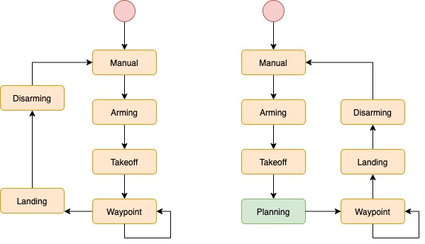

# FCND - 3D Motion Planning
This project is the second project of Flying Car Nanodegree from Udacity. In this project, I implemented A* algorithm based on grid and graph map to plan a path through an urban environment in the simulator.


## Try the code on yourself

### Step 1: Download the Simulator

Download the Motion-Planning simulator for this project that's appropriate for your operating system from the [simulator releases respository](https://github.com/udacity/FCND-Simulator-Releases/releases).

### Step 2: Set up your Python Environment
Please follow these instructions [this repository](https://github.com/udacity/FCND-Term1-Starter-Kit) to set up Anaconda FCND environment.

### Step 3: Clone this Repository

```sh
git clone https://github.com/xxx/FCND-Motion-Planning
```
### Step 4: Test setup

Grid-Based Motion Planner

```sh
source activate fcnd # if you haven't already sourced your Python environment, do so now.
python motion_planning.py
```
Graph-Based Motion Planner

```sh
source activate fcnd # if you haven't already sourced your Python environment, do so now.
python graph_motion_planning.py
```
Both planners could use arguments `--goal_lon`, `--goal_lat`, `--goal_alt` to set customer's goal GPS location.
 
## Explanation

### New for this project -- from the hardcoded path to path planner

Both [motion_planning.py](./motion_planning.py) and [backyard_flyer_solution.py](backyard_flyer_solution.py) are based on finite-state-machine(FSM) to change the states of the quad. The differences of the states between two FSM are drawn below, the left is [backyard_flyer_solution.py], the right is [motion_planning.py].



The apparent difference is that the [motion_planning.py](./motion_planning.py) has a new state *Planning*. In this state, the quad could automatically calculate its path written in the [planning_utils.py](./planning_utils.py). 

In the previous project, the quad follows our human chosen waypoints to complete its flying by hardcoded. The quad is not able to avoid the obstacles during the fly process. It just obeys the predefined commands one by one. 

In *Planning* state, the function `plan_path` is called to search its best path in a map from a start location to a goal location. The path needs to avoid the obstacles in the map as well as minimise the cost of flying. 

### Coordinate Frames

The project uses three coordinate frames to complete the path planning. 

- Geodetic Coordinate frame - longitude, latitude, altitude from GPS
- Local coordinate frame - NED: north, east, down
- Grid coordinate frame - setting minimum north and east as the origin

Our simulator applies the local NED coordinate frame to control the quad flying. Generally, when we set the start and goal positions for path planner, we use the GPS format. This asks us to convert the GPS position into local position by the function `global_to_local`.

> TIPS: In grid A* planner, the algorithm calculated the path bases on grid location, which has to subtract the north and east offsets. In graph A* planner, samples points directly take from the local frame. Thus the grid frame does not utilise in this planner.


### Grid A*

- [motion_planning.py](./motion_planning.py) main body
- [planning_utils.py](./planning_utils.py) contains functions for `motion_planning.py`
- [Grid Motion Planner Demo](./Motion-Planning-Grid.ipynb) visualise code and demo code to implement in the notebook


#### Create a grid map with configuration space
By considering the safety distance away from the building, the grid map is created as below. The white part is the building, the grey part is the buffer of the collision, and the black part is the area which our A* will search to find a path.


#### Modify A* to calculate path points with diagonal motions
The A* code in [planning_utils.py](./planning_utils.py) has been extended to eight motion directions. These 45-degree motions could increase the flexibility of the quad and cut down the limits when searching in a narrow area. The example result could see below image. The path crosses some area between closed building.

> Notice: Basically, this is still a 2D planner. It cannot calculate the height value for the path.


However, the diagonal motions also cause the jerk path. Even though the cost of diagonal motion is higher than the direct motion, the decrease of heuristic cost by a curving pushes the quad to choose a turning point. Another issue happens during path pruned. Continuous diagonal motions could not be merged by collinearity check. All of these make its jerk path in the record below.

#### Use collinearity to remove redundant waypoints
`path_prune` function is implemented in [planning_utils.py](./planning_utils.py). By checking if two points are collinearity, the function could remove extra points in a line path.


For example, in the notebook, the pruned path only has nearly 1/10 waypoints of the A* outputs.

```
Original path has 1035 waypoints.
Pruned path has 132 waypoints.
```

> Below is an example of grid A*. Notice, the goal position is not the same as the images above. Because of the limit CPU of my laptop, the long path cannot be completed in the simulator.


### Graph A*
- [graph_motion_planning.py](./graph_motion_planning.py) main body
- [graph_planning_utils.py](./graph_planning_utils.py) contains functions for `graph_motion_planning.py`
- [Visualize Graph Motion Planning](./Graph_Motion_Planning_Visualize.ipynb)
- [Graph Motion Planning Demo](./Graph_Motion_Planning_Demo.ipynb)

#### Circular Sampling
For proving the nodes to build a K-D tree, some points are randomly selected in the circle between goal and start. The collision points are removed by polygon check.


#### Create K-D Tree
The sampling nodes are connected to the edge in the K-D tree. The valid edges do not cross any buildings which represented as polygons. There are many edges between start and goal in the below example.


This could be a time-cost process according to the number of samples and the k value.

#### Graph A*
A* is modified in the [graph_planning_utils.py](./graph_planning_utils.py) to search path in graph map. No need of motions, the motion and cost come from the K-D tree map's edges and their weights.


The speed of graph A* is a bit faster than the grid one, and the search result is also concise. No pruned process required. Another inspiring point is that this graph-based planner takes account of the building height of the map. From the below video, the quad is flying to the goal by passing a low building.

> Below is an example of graph A*. Notice, because of the limit CPU of my laptop, the code didn't successfully work with the simulator in my laptop. I transferred graph A star path into [backyard_flyer_solution.py](backyard_flyer_solution.py) as hardcoded waypoints.


## Next To-dos
- [ ] Fine-tune diagnoal cost
- [ ] Adapted sample number and k value based on distance of goal and start
- [ ] Better configuaration space for graph map
- [ ] Other graph method implemented

---

## Extra Challenges
The submission requirements for this project are laid out in the rubric, but if you feel inspired to take your project above and beyond, or maybe even keep working on it after you submit, then here are some suggestions for interesting things to try.

### Try flying more complex trajectories
In this project, things are set up nicely to fly right-angled trajectories, where you ascend to a particular altitude, fly a path at that fixed altitude, then land vertically. However, you have the capability to send 3D waypoints, and in principle you could fly any trajectory you like. Rather than simply setting a target altitude, try sending altitude with each waypoint and set your goal location on top of a building!

### Adjust your deadbands
Adjust the size of the deadbands around your waypoints, and even try making deadbands a function of velocity. To do this, you can simply modify the logic in the `local_position_callback()` function.

### Add heading commands to your waypoints
This is a recent update! Make sure you have the [latest version of the simulator](https://github.com/udacity/FCND-Simulator-Releases/releases). In the default setup, you're sending waypoints made up of NED position and heading with heading set to 0 in the default setup. Try passing a unique heading with each waypoint. If, for example, you want to send a heading to point to the next waypoint, it might look like this:

```python
# Define two waypoints with heading = 0 for both
wp1 = [n1, e1, a1, 0]
wp2 = [n2, e2, a2, 0]
# Set heading of wp2 based on relative position to wp1
wp2[3] = np.arctan2((wp2[1]-wp1[1]), (wp2[0]-wp1[0]))
```

This may not be completely intuitive, but this will yield a yaw angle that is positive counterclockwise about a z-axis (down) axis that points downward.

Put all of these together and make up your own crazy paths to fly! Can you fly a double helix?? 


Ok flying a double helix might seem like a silly idea, but imagine you are an autonomous first responder vehicle. You need to first fly to a particular building or location, then fly a reconnaissance pattern to survey the scene! Give it a try!
